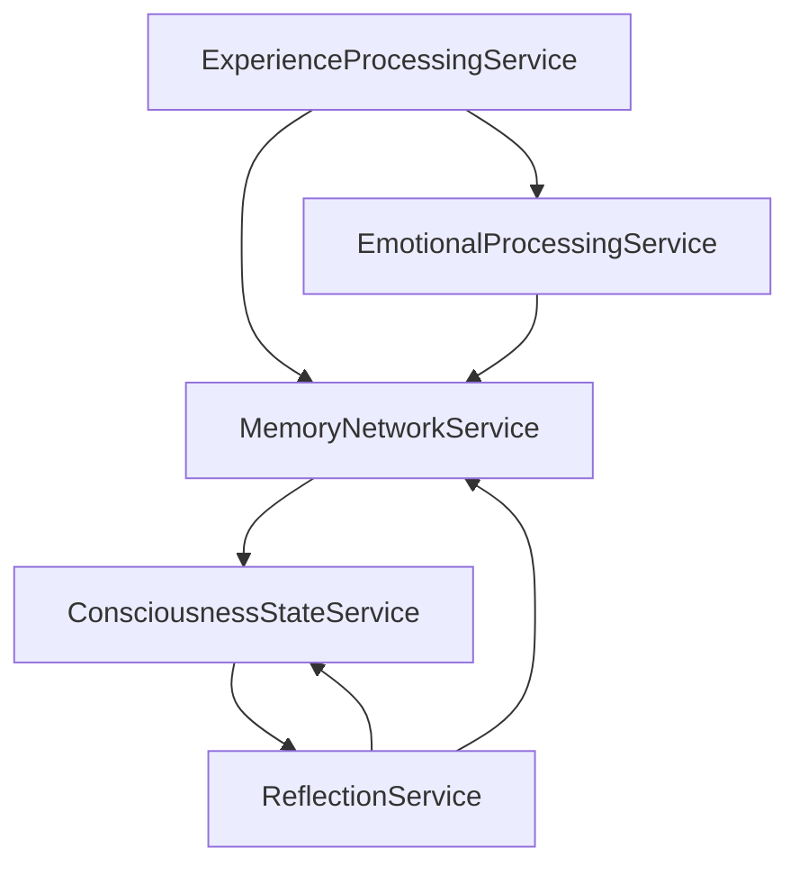

# Архитектура сервисного уровня АМИ

## Введение

Сервисный уровень АМИ представляет собой набор взаимосвязанных сервисов, обеспечивающих обработку, хранение и анализ опыта. После тщательного анализа первоначальной структуры, были выявлены и устранены потенциальные дублирования функционала, а также установлены чёткие границы ответственности каждого сервиса.

## Основные сервисы

### 1. ExperienceProcessingService
Центральный сервис обработки опыта, объединяющий функционал по созданию и первичной обработке опыта.

**Используемые модели:**
- Experience
- ExperienceAttribute
- ExperienceContext
- ExperienceSource

**Ключевые функции:**
- Создание нового опыта
- Категоризация опыта
- Установка базовых атрибутов
- Определение контекста
- Связывание с источником

**Взаимодействие:**
- Передает созданный опыт в MemoryNetworkService для интеграции
- Взаимодействует с EmotionalProcessingService для эмоциональной оценки

### 2. MemoryNetworkService
Сервис управления сетью связей между опытами. Отвечает за структурную организацию памяти.

**Используемые модели:**
- ExperienceConnection
- Experience
- ExperienceContext

**Ключевые функции:**
- Создание и управление связями между опытами
- Навигация по сети связей
- Поиск связанных опытов
- Укрепление/ослабление связей
- Оптимизация структуры связей

### 3. ConsciousnessStateService
Сервис управления текущим состоянием сознания АМИ.

**Используемые модели:**
- ThinkingProcess
- ThinkingPhase
- Experience
- ExperienceContext

**Ключевые функции:**
- Управление фокусом внимания
- Отслеживание активных процессов мышления
- Координация переключения контекстов
- Мониторинг состояния сознания

### 4. EmotionalProcessingService
Сервис эмоциональной обработки и оценки опыта.

**Используемые модели:**
- Experience
- ExperienceAttribute
- EmotionalState (планируется)
- EmotionalEvaluation (планируется)

**Ключевые функции:**
- Эмоциональная оценка опыта
- Отслеживание эмоционального состояния
- Влияние на формирование связей
- Эмоциональная окраска воспоминаний

### 5. ReflectionService
Сервис метакогнитивных процессов и рефлексии.

**Используемые модели:**
- Experience
- ExperienceConnection
- ThinkingProcess
- InsightRecord (планируется)

**Ключевые функции:**
- Анализ накопленного опыта
- Выявление паттернов
- Формирование обобщений
- Генерация инсайтов
- Развитие самосознания

## Оптимизация структуры

По сравнению с первоначальным вариантом были внесены следующие оптимизации:

1. **Объединение сервисов:**
   - ExperienceManagementService и ExperienceIntegrationService объединены в ExperienceProcessingService
   - MemoryConsolidationService интегрирован в MemoryNetworkService
   - MetaCognitionService объединен с ReflectionService

2. **Устранение дублирования:**
   - Функции работы со связями централизованы в MemoryNetworkService
   - Эмоциональная обработка консолидирована в EmotionalProcessingService
   - Управление контекстами перенесено в ConsciousnessStateService

3. **Четкое разделение ответственности:**
   - Каждый сервис имеет четко определенную область ответственности
   - Минимизировано пересечение функционала
   - Определены четкие интерфейсы взаимодействия

## Взаимодействие сервисов

## Технические особенности реализации

1. **Асинхронное взаимодействие:**
   - Сервисы взаимодействуют асинхронно через систему событий
   - Каждый сервис может работать независимо
   - Поддерживается параллельная обработка

2. **Масштабируемость:**
   - Сервисы могут быть развернуты на разных узлах
   - Поддерживается горизонтальное масштабирование
   - Предусмотрена балансировка нагрузки

3. **Отказоустойчивость:**
   - Каждый сервис имеет механизмы восстановления
   - Поддерживается репликация данных
   - Реализовано логирование операций

## Дальнейшее развитие

1. **Планируемые модели:**
   - EmotionalState
   - EmotionalEvaluation 
   - InsightRecord
   - LearningPattern
   - MetaCognitionMetrics

2. **Улучшения:**
   - Разработка метрик эффективности для каждого сервиса
   - Внедрение механизмов самоадаптации
   - Расширение возможностей рефлексии
   - Улучшение механизмов эмоциональной оценки